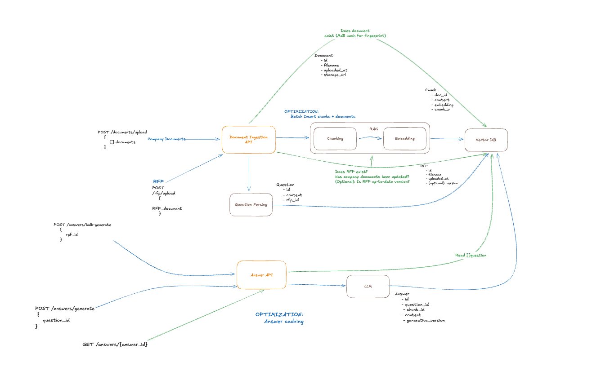

# RFP Answer Generator Documentation

## Purpose

This project is a simplified RFP Answer Generator that:

- ingests company PDFs into a searchable knowledge base,
- parses questions from an uploaded RFP PDF,
- generates answers using Retrieval-Augmented Generation (RAG),
- returns structured question/answer results through API endpoints and a React UI.

The goal is to reduce manual effort in drafting RFP responses while grounding answers in uploaded company documents.

## System design decisions and why

### 1. FastAPI backend with worker-style orchestration

Core business logic is handled in worker classes (`DocumentIngestorWorker`, `QuestionWorker`, `AnswerWorker`, `RfpBulkAnswerWorker`) and route handlers stay thin.

Why:

- keeps HTTP concerns separated from ingestion/answer orchestration,
- makes logic easier to test independently of routes,
- enables reuse across single-answer and bulk-answer paths.

### 2. PostgreSQL + pgvector for storage and retrieval

The backend stores relational records (documents, questions, answers, versions) and vector embeddings in Postgres.

Why:

- one datastore for both metadata and vector search,
- transactional consistency for ingest/generate flows,
- simpler deployment than splitting SQL + external vector DB for this scope.

### 3. RAG flow design

Document ingestion:

- extract PDF text,
- chunk text,
- embed chunks,
- persist chunk content + vectors.

Answer generation:

- embed question,
- retrieve top-k similar chunks by cosine similarity,
- compose context,
- call LLM and map output to ORM answers.

Why:

- supports grounded answer generation with explainable retrieval behavior,
- keeps implementation aligned to challenge requirements for basic RAG.

RAG retrieval tradeoff (intentional):

- I intentionally do **not** perform a second-stage re-ranking pass after vector retrieval.
- Reason A: simplicity. A single-stage retrieval pipeline is easier to reason about, test, and maintain for this challenge scope.
- Reason B: latency. The API is currently synchronous (no background job queue), so I prioritized lower end-to-end response time over marginal retrieval quality gains from re-ranking.
- This is a deliberate tradeoff for the current architecture; re-ranking is a natural next step once async processing is introduced.

### 4. Config-driven runtime behavior

Key tunables (chunk window/overlap, top-k, thresholds, model names, prompt paths) are in config/env instead of hardcoded.

Why:

- allows quick iteration without code changes,
- makes behavior explicit and easier to tune during evaluation.

### 5. Read-optimized chunk indexing strategy

I indexed `Chunk` on `(doc_id, order, chunk_version_id)` (see the composite unique index in `answer_gen/storage/chunk.py`) to optimize expected query patterns when reconstructing and reading chunk sets for retrieval.

Why:

- traffic is expected to be read-heavy on chunk retrieval (frequent answer generation),
- document ingestion/uploads are comparatively less frequent writes,
- this index improves chunk access locality by document/version while preserving chunk order.

I intentionally did **not** add a comparable document-oriented answer index because I expect many unique/new RFP uploads, which implies higher write volume for answers and lower reuse hit rates for existing answers. The tradeoff here favors write throughput and simpler answer inserts over additional read indexing on answers.

## How AI tools were used, what worked/didn’t

### How AI tools were used

I used both Codex and Claude Code for the project. AI assistance was used for:

- scaffolding APIs and worker wiring,
- iterating SQLAlchemy model/relation definitions,
- generating and refining UI flows for upload + result review,
- scaffolding tests and testing logic
- Adding doc strings and additional, clear comments to existing code

### What worked well

- Fast boilerplate generation for routes, models, and React pages.
- Handling time-consuming, repetitive tasks such as doc strings, commenting, generating LLM prompts, etc.
- Productive iteration on architecture tradeoffs (repo facade vs simpler persistence access, worker boundaries).

### What didn’t work well

- AI-generated code occasionally introduced mismatched assumptions (stale imports, signature drift, route/body mismatches).
- Some suggestions leaned over complication for a 3–5 hour scope, requiring manual simplification.
- Code generated violated SRP, was too heavily coupled to other components and low level details, or was too procedural in some cases

### Practical process used

- Build in thin vertical slices (ingest -> parse -> answer -> UI).
- Use AI for first draft, then manually verify behavior in actual request/response paths.
- Keep changes small and test integration points quickly before layering additional abstractions.

## What I’d do differently with more time

1. Add comprehensive tests:
   - worker unit tests with mocks,
   - API integration tests for upload/parse/generate flows,
   - regression tests for parser/mapping edge cases.
2. Improve observability:
   - structured logging with request IDs and durations,
   - metrics for chunking/embedding/LLM latency and failure rates.
3. Introduce Pub/Sub scalable clusters for heavy tasks such as ingestions or answer generation (queue-based ingestion/generation).
4. Introduce an asyncronous API with client-side polling, with each long-running ingestion endpoint returning a job_id, and additional endpoints for checking the status of a given job.
5. Add answer caching to decrease answer generation endpoint latency
6. Split the Document Ingestion API and Answer API into seperate services so they can be scaled independently.
7. Store Question embeddings in storage for rapid retrieval, reducing latency for re-uploaded RFP's.

## API documentation (OpenAPI + key endpoints)

OpenAPI is generated by FastAPI and available at runtime:

- Swagger UI: `http://localhost:9001/docs`
- OpenAPI JSON: `http://localhost:9001/openapi.json`

### Endpoints

#### `POST /api/documents/upload`

Uploads one or more company PDFs for ingestion.

- Content-Type: `multipart/form-data`
- Field: `documents` (repeatable file field)
- Response (`200`):
  - `{ "inserted_document_ids": [<id>, ...], "failed": { "bad.pdf": "..." } }`

#### `POST /api/rfp/upload`

Uploads a single RFP PDF and extracts questions.

- Content-Type: `multipart/form-data`
- Field: `rfp` (single file)
- Response (`200`):
  - `{ "rfp_id": <id>, "questions": [...<q_id>] }`

#### `POST /api/answers/generate`

Generates answer(s) for a single question.

- Content-Type: `application/json`
- Body: `{ "question_id": <int> }`
- Response (`200`):
  - `{ "rfp_id": <id?>, "questions": [{"id": <id>, "content": <content>, ...answer}]}`

#### `POST /api/answers/bulk-generate`

Generates answers for all unanswered questions associated with an RFP.

- Content-Type: `application/json`
- Body: `{ "rfp_id": <int> }`
- Response (`200`):
  - `{ "rfp_id": <id?>, "questions": [{"id": <id>, "content": <content>, ...answer}, ...] }`

#### `GET /api/answers/{answer_id}`

Fetches one answer by ID.

- Response (`200`):
  - `{ "answer": { "id": <id>>, "content": "...", "question_id": <q_id>, "answer_version_id": <a_id>, "created_at": "..." } }`

## Usage

Dependencies:
- Python >= 3.11
- npm >= 8.15.0
- OpenAI API key (set as LLM_API_KEY in environment variables)

1. Create .env file
2. Copy .env.example into .env file
3. Set env vars (`LLM_API_KEY`)
4. Install dependencies (`pip install -r requirements.txt`)
5. Start services (`bash bin/launch_server.sh`).
6. Use UI (http://127.0.0.1:5173/) with sample documents in `/docs` to run:
   - upload company docs,
   - upload RFP,
   - bulk-generate answers.
7. (Optional): run pytest to check output of tests
